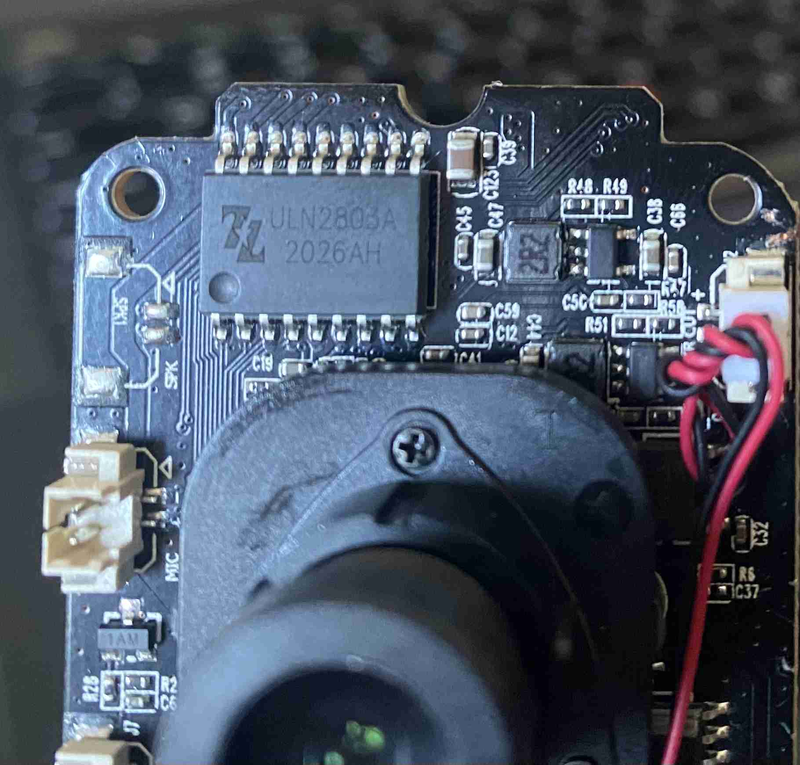
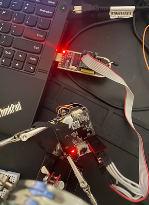
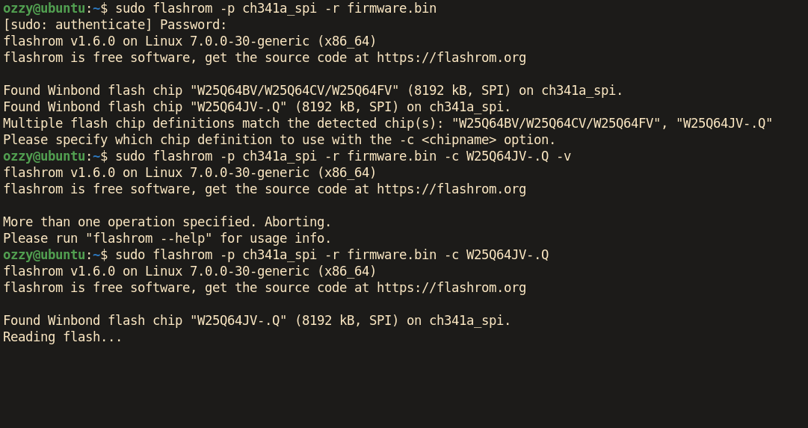
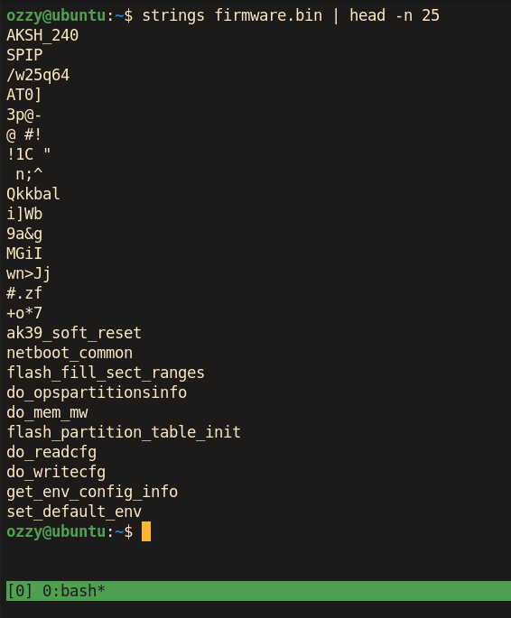
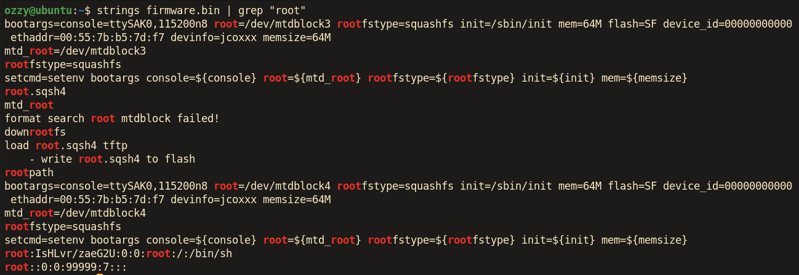

# BLOG 1: Extracting SPI Flash from a GHome Smart Camera 		

		

## Target's Intended Functionality & Our Goal			
	- 

## Chip Identification		

	
	
		

		

## Signal Interposition: Extracting SPI Flash 		

		
		
		
		

