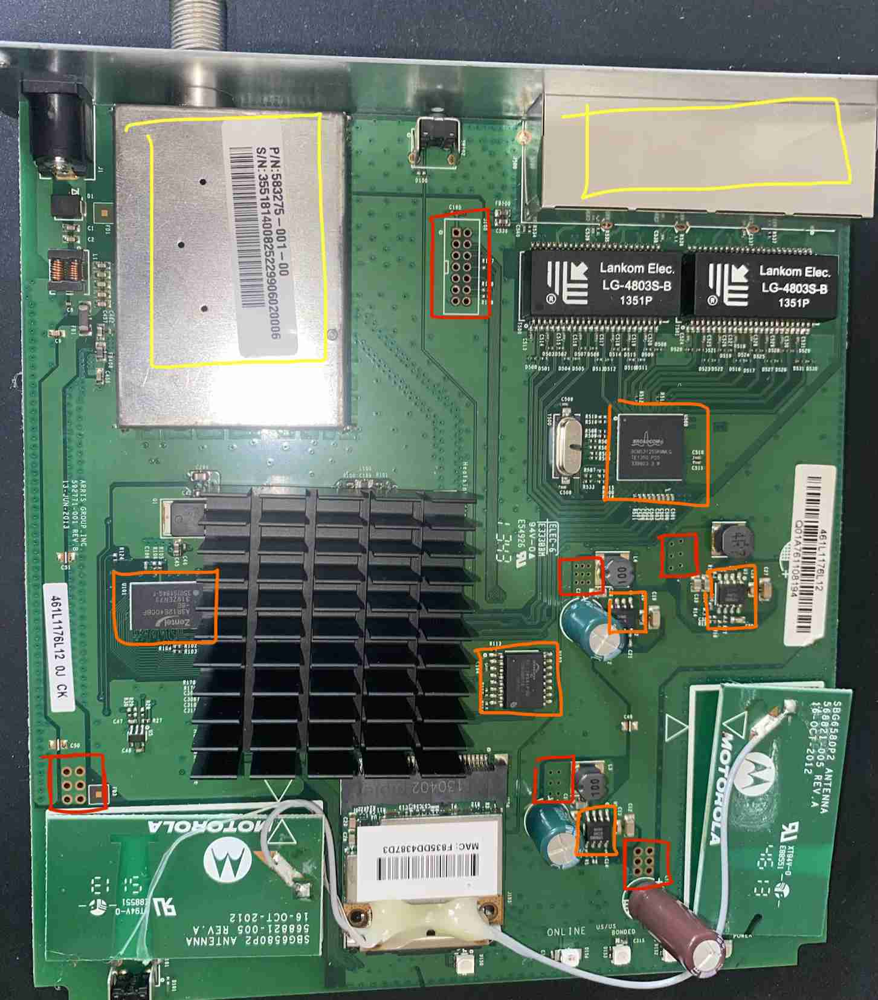
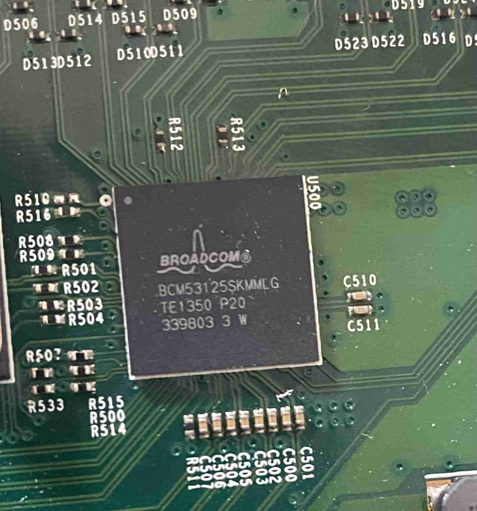
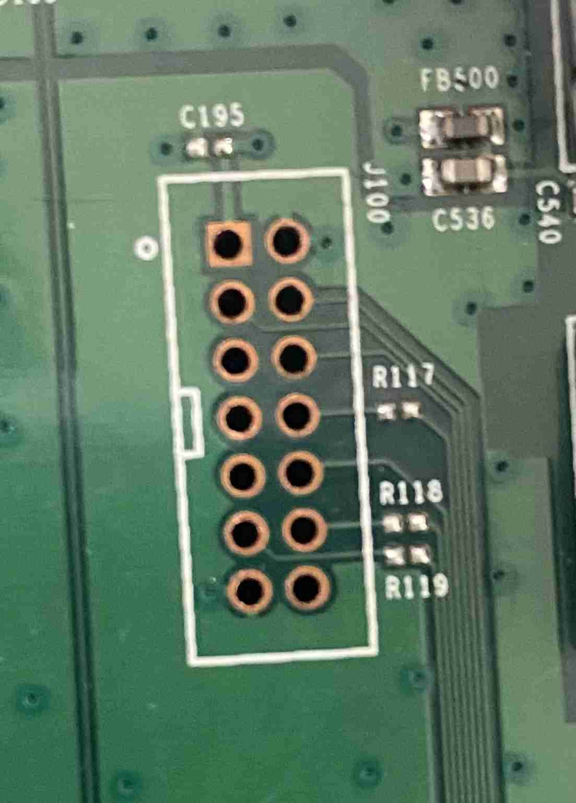
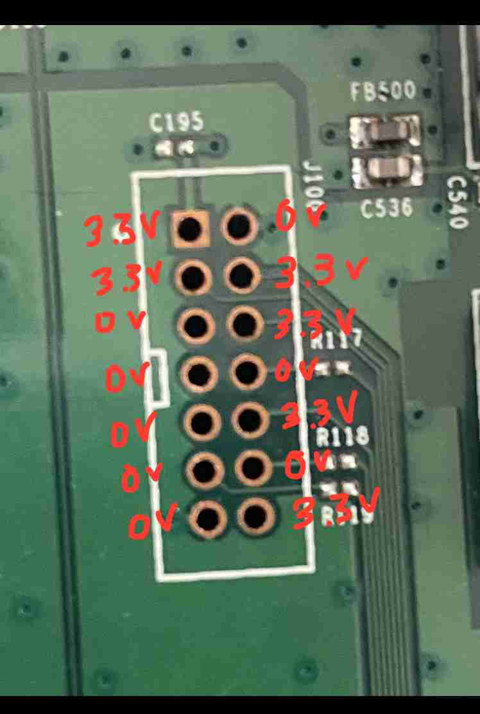
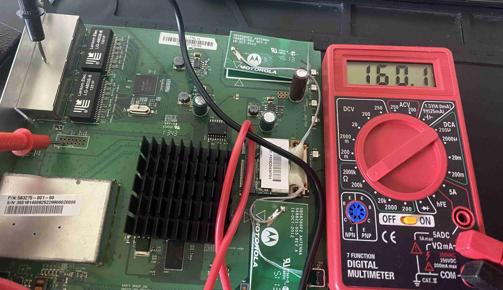
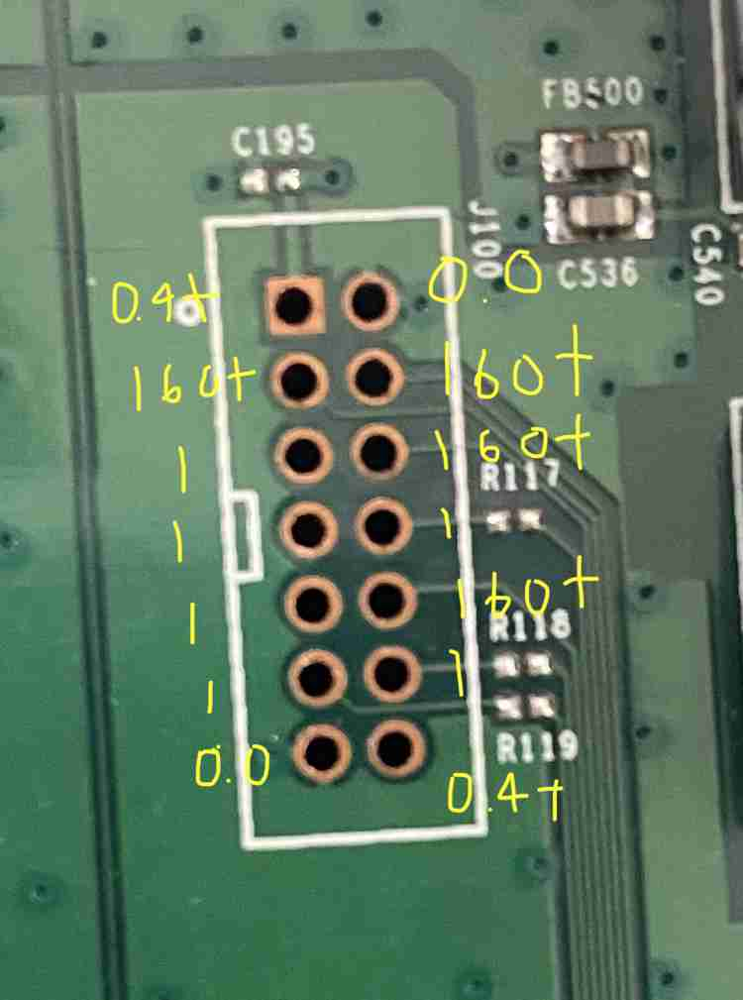

# B10G 2: Extracting Firmware from a Motorola SURF Router through JTAG		


## Target's Intended Functionality & Our Goal		


## Chip Identification		


		
		
			
		


## Signal Analysis		

		


### Voltage Tests	

		
		
		
		
		
		

### Resistance Tests: Identifying JTAG	

		
		


## Signal Interposition: Interacting with JTAG		

### Determing JTAG Pinout with go-jtagenum		
		

- https://github.com/gremwell/go-jtagenum	


* GND Pins (2,13)		
	- 0.0 ohms		

* Active Signal/pull up pins(3,4,6,10)		
	- read 3.3v active, and show a higher resistance 140+ ohms	
	- indicates theyre connected to the internal pull up resistors 	
	- our prime JTAG candidates (TMS,TCK,TDI,TRST)		

* Main power pin(1,14)	
	- read 3.3v, but showed low resistance of 0.4+ ohms	

* Floating pins (5,7,8,9,11,12)	
	- reads "1", means an open loop 
	- one is likely our TDO pin 
	- TDO on an idle chip is floating until it receives command to output data	

* Wiring our Orange Pi Zero 2w		
	1. Reference GND	
		- connect pin 2 or 13 from router to Pin 6(GND) on our pi		

	2. Isolate pwr		
		- we're going to avoid connecting pins 1,14 on the router to anything because theyre tied to the main power line	
		- this avoids causing a short	

	3. Probing		
		- connecting our pi test/gpio pins to all that measured 140+ ohms	
		- Pin 2 or 13 on router to pin 6(GND) on pi	
		- Router pins(TMS,TCK,TDI TRST candidates): 3,4,6,10 -> pi gpio test
		- Pi gpio test pins: 7,11,13,15 (find way to edit pi and script to match

		(separate test)			
		- Router pins: 5,7,9,11,12 (TDO candidate) -> Pi gpio test	 


		
* Preparing pin config in JSON format		
	- GND pin connected as well of course	

	- pin# is our pins on the router 
		- so pin1=3, pin2=4, pin3=6, pin4=10	

	- actual value is gpio on opi 2w		
		- below	
`{ "pin1": 7, "pin2": 11, "pin3": 13, "pin4": 15 }`		


* Check for loops		

`go-jtagenum -pins '{ "pin1": 7, "pin2": 11, "pin3": 13, "pin4": 15 }' -command check_loopback`


* Enumeration		
`go-jtagenum -pins '{ "pin1": 7, "pin2": 11, "pin3": 13, "pin4": 15 }' -command scan_bypass`		


* Dump IDCODE	
`go-jtagenum -pins '{ "pin1": 7, "pin2": 11, "pin3": 13, "pin4": 15 }' -command scan_idcode`


* Verify determined pins		
`go-jtagenum -known-pins '{ "tdi": #, "tdo": #, "tms": #, "tck": #, "trst": #}' -command test_bypass`		

`go-jtagenum -known-pins '{ "tdi": #, "tdo": #, "tms": #, "tck": #, "trst": #}' -command test_idcode`	


### Determining Instruction Length with UrJTAG		
	- https://sourceforge.net/projects/urjtag/		

```		
./configure		
make		
make install			
```		


### JTAG Debugging via OpenOCD				


